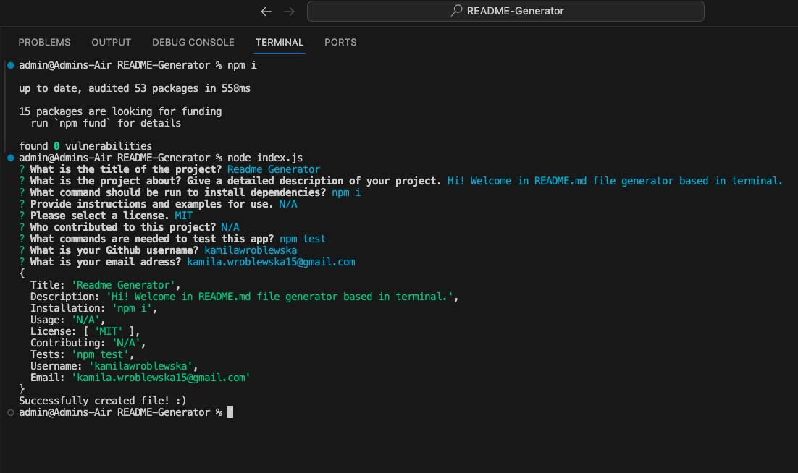
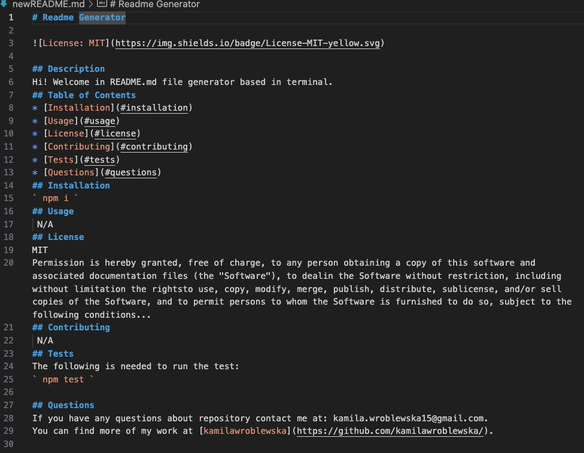
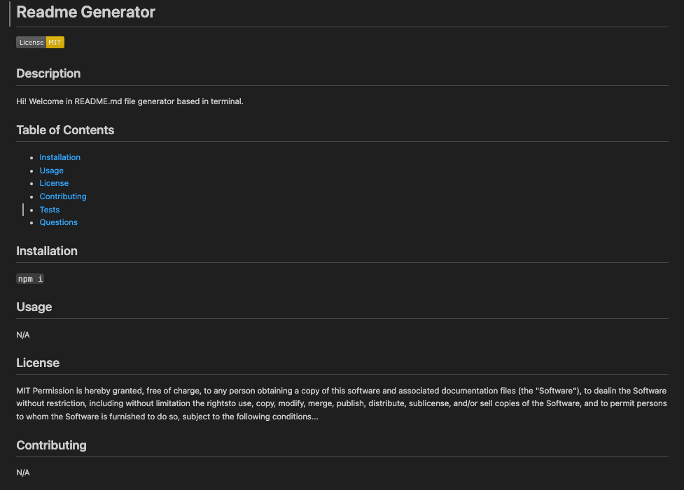

# README file Generator

  
[WALKTHROUGH VIDEO](https://youtu.be/EPKQA78WZHk)
  [Github Repo](https://github.com/kamilawroblewska/README-Generator)
## Description
Hi ! Welcome to my terminal app generating proffessional README.md files.
## Table od Contents
* [Installation](#installation)
* [Usage](#usage)
* [License](#license)
* [Contributing](#contributing)
* [Tests](#tests)
* [Questions](#questions)
## Installation
` npm i `
## Usage

## License
This project is licensed under the MIT license.
## Contributing
N/A
## Tests
The following is needed to run the test: ` npm test `
## Questions
If you have any questions about repository, open an issue or contact me at: kamila.wroblewska15@gmail.com
You can find more of my work at [kamilawroblewska](https://github.com/kamilawroblewska/).
